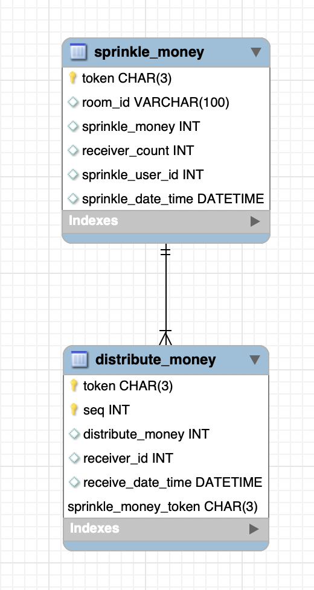

# 카카오페이 뿌리기

* * *

## 목차
1. 개발환경
2. 데이터베이스 DDL
3. 핵심문제해결 설명

* * *

## 개발환경

- java 1.8
- spring boot 2.3.3.RELEASE
- mysql 8.0.19
- mybatis
- spock

* * *

## 데이터베이스 DDL
```
CREATE TABLE `kakaopay`.`sprinkle_money` (
  `token` CHAR(3) NOT NULL,
  `room_id` VARCHAR(100) NULL,
  `sprinkle_money` INT NULL,
  `receiver_count` INT NULL,
  `sprinkle_user_id` INT NULL,
  `sprinkle_date_time` DATETIME NULL,
  PRIMARY KEY (`token`));

CREATE TABLE `kakaopay`.`distribute_money` (
  `token` CHAR(3) NOT NULL,
  `seq` INT NOT NULL,
  `distribute_money` INT NULL,
  `receiver_id` INT NULL,
  `receive_date_time` DATETIME NULL,
  PRIMARY KEY (`token`, `seq`));
```


* * *

## 핵심문제해결 설명
1. 카카오페이 뿌리기 API
 - Request
    ```
    POST http://localhost:8080/sprinkle/money
    Content-Type: application/json
    X-ROOM-ID: room
    X-USER-ID: 31337
    
    {
      "sprinkleMoney": 25000000,
      "receiverCount": 8
    }
    ```
 - Response
    ```
    {
      "success": true,
      "data": "n6B"
    }
    ```
   
 - 사용자가 뿌리기를 요청하면 최초 뿌리기 정보를 뿌리기 테이블(sprinkle_money)에 저장하고, 뿌린금액을 분배하여 분배 테이블(distribute_money)에 저장을합니다.
 - Token 생성은 apaceh commons lang의 RandomStringUtils를 이용하여 Aphanumeric 한 스트링 3자를 얻습니다.
 - 분배로직은 인원수 만큼 loop를 돌며 0~남아있는 금액만큼에서 난수를 생성합니다. 마지막 분배금액은 난수생성이 아닌 마지막으로 남아있는 금액으로 대체합니다.

2. 카카오페이 뿌리기 받기 API
 - Request
    ```
    PUT http://localhost:8080/receive/money
    Content-Type: application/json
    X-ROOM-ID: room
    X-USER-ID: 1
    
    {"token": "n6B"}
    ```
 - Response
    ```    
    {
      "success": true,
      "data": 19488510
    }
    ```
 - 사용자가 뿌리기 받기롤 요청하면 해당 토큰에 맞는 뿌리기 정보를 조회합니다. 이 후 유효성검사를 진행하게 됩니다.
 - 유효성 검사에서 각 상황별로 Exception을 터트립니다. 
 - Exception 처리는 Controller에서 Exception Handler를 통해 일괄적으로 처리합니다.
 - 사용자가 받을 금액의 정보는 분배 테이블에서 아직 할당되지 않은 정보 1개를 할당합니다. (분배 테이블에서 받는 사용자 정보가 없는 데이터 1개 조회)

3. 카카오페이 뿌리기 조회 API
 - Request
    ```
    GET http://localhost:8080/search/money?token=HdH
    Content-Type: application/json
    X-USER-ID: 31337
    ```
 - Response
    ```
    {
      "success": true,
      "data": {
        "sprinkleDateTime": "2020-08-25T08:20:13",
        "sprinkleMoney": 25000000,
        "receivedMoney": 19488510,
        "receiveMoneyList": [
          {
            "receiverId": 1,
            "receiveMoney": 19488510
          }
        ]
      }
    }
    ```
 
 - 사용자가 뿌리기한 정보(sprinkle_money)를 조회하고, 해당 뿌리기에 분배된 정보(distribute_money) 중에 받은 사람이 있는 정보만 조회합니다.
 - 받기 완료된 정보를 조회하여 Stream mapToInt를 사용하여 최종적으로 받기 완료된 금액을 구합니다.

* * *
